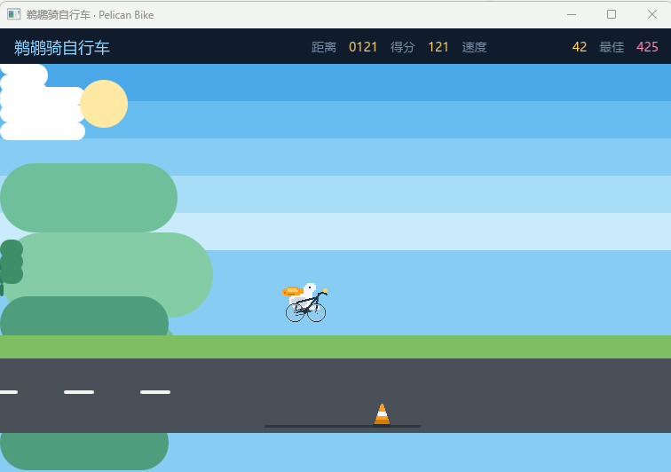

# 我使用xbintsc编译了一款小游戏
起因想要做一个桌面端小游戏，但选择框架的时候，但是发现并没有一个很好的选择。
1. Electron 过于庞大，内部集成了node.js和chrome谷歌浏览器
2. Tauri 虽然客户端小，但是使用系统自带的 WebView 渲染，会导致不同机器运行结果不一致

于是我准备使用xbintsc,去编译这款桌面小游戏。

首先xbintsc优势：
1. 构建体积小，最小可达200kb，编译可选node扩展(支持部分node.js的API)最小可达300kb，编译可选GUI扩展(可视化界面HTML渲染)最小可达3MB
2. 冷启动是node.js的120倍+，且原生支持HTML+CSS渲染。
3. 全平台支持(使用LLVM构建不同平台二进制产物，使用GPU的SDL进行渲染并在不同平台使用Vulkan/Metal进行编译)

直接让AI开发了鹈鹕骑车小游戏，并使用xbintsc编译了，截图如下：

编译后的结果大概是5M左右，运行效果很流畅，当然直接打开源码的HTML也可以直接玩。

小游戏源码地址：[https://github.com/zy445566/xbintsc/tree/main/examples/gui/pelican-bike](https://github.com/zy445566/xbintsc/tree/main/examples/gui/pelican-bike)

当然有兴趣下载鹈鹕骑车小游戏编译结果，也编译了多个不同平台windows/mac/ubutun26+的版本。

编译结果地址：[https://github.com/zy445566/xbintsc/releases/tag/v0.3.65](https://github.com/zy445566/xbintsc/releases/tag/v0.3.65)

选择pelican-bike-demo-v0.3.65-multi-platform.zip下载，解压后选择自己的平台就能运行。

由于该游戏目前没有做签名，所以可能会有系统的安全性拦截。
macOS 打开后需要：打开“系统设置” → “隐私与安全性”，向下滚动到“安全性”，选择“仍要打开”运行。
Windows 打开后，如出现“Windows 已保护你的电脑”，点击“更多信息”，点击“仍要运行”。

大家有兴趣，也可以用xbintsc编译一款自己的小游戏，甚至可以跟Ai Agent说“用xbintsc(https://github.com/zy445566/xbintsc)帮我生成一个鹈鹕骑车小游戏”